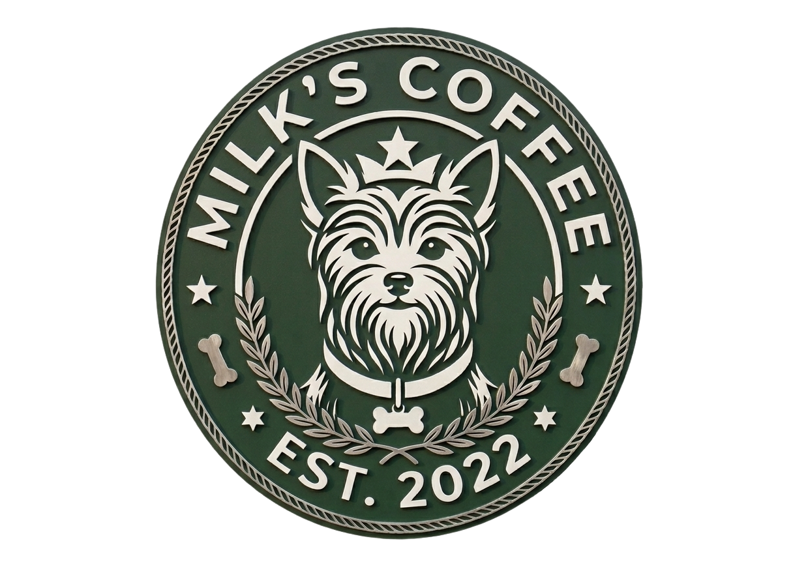

# 💻 Automação Web | Milk's Coffee (Cypress)

Este módulo é dedicado à garantia de qualidade do painel administrativo (Web) do Milk's Coffee. A suíte foi desenvolvida em **Cypress**, implementando o padrão arquitetural **Page Object Model (POM)** aliado à escrita de cenários em **BDD (Behavior-Driven Development)**.

---

## 🏗️ Estratégia de Qualidade

A arquitetura foi pensada para facilitar a manutenção e a legibilidade dos testes de regressão:
* **Features:** Cenários de negócio descritos de forma clara, documentando o comportamento esperado.
* **Page Objects:** Separação estrita entre a lógica de interação com o DOM e as validações de negócio, tornando os testes imunes a pequenas mudanças de layout.
* **Fixtures:** Uso de massa de dados mockada e controlada para testes previsíveis.

---

## 🎯 Cobertura de Testes

* Fluxos de autenticação do administrador.
* Validação de perfis de acesso (Cliente vs Admin).
* Gestão e listagem do catálogo de produtos.

---

## ⚙️ Como executar localmente

**Pré-requisitos:** Node.js instalado.

1. Acesse a pasta do projeto web no terminal:
cd milks-coffee/web

2. Instale as dependências do projeto:
npm install

3. Para abrir a interface interativa do Cypress (Modo Visual):
npx cypress open

4. Para rodar todos os testes em background (Modo Headless) ideal para CI/CD:
npx cypress run